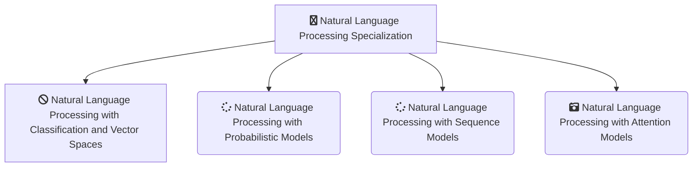

-------------------------------------------------------------------------------------------

-------------------------------------------------------------------------------------------

# [DeepLearning.AI - Natural Language Processing Specialization](https://www.coursera.org/specializations/natural-language-processing)
*This Repository Contains Solution to the Assignments of the Natural Language Processing Specialization from Deeplearning.ai on Coursera Taught by 
[Younes Bensouda Mourri](https://www.coursera.org/instructor/ymourri),
[Łukasz Kaiser](https://www.coursera.org/instructor/lukaszkaiser),
[Eddy Shyu](https://www.coursera.org/instructor/eddy-shyu)*

-------------------------------------------------------------------------------------------

## WHAT YOU WILL LEARN

- Use logistic regression, naïve Bayes, and word vectors to implement sentiment analysis, complete analogies & translate words.
- Use dynamic programming, hidden Markov models, and word embeddings to implement autocorrect, autocomplete & identify part-of-speech tags for words.
- Use recurrent neural networks, LSTMs, GRUs & Siamese networks in Trax for sentiment analysis, text generation & named entity recognition.
- Use encoder-decoder, causal, & self-attention to machine translate complete sentences, summarize text, build chatbots & question-answering.

---

## About this Specialization

Natural Language Processing (NLP) is a subfield of linguistics, computer science, and artificial intelligence that uses algorithms to interpret and manipulate human language. 

This technology is one of the most broadly applied areas of machine learning and is critical in effectively analyzing massive quantities of unstructured, text-heavy data. As AI continues to expand, so will the demand for professionals skilled at building models that analyze speech and language, uncover contextual patterns, and produce insights from text and audio.

By the end of this Specialization, you will be ready to design NLP applications that perform question-answering and sentiment analysis, create tools to translate languages and summarize text, and even build chatbots. These and other NLP applications are going to be at the forefront of the coming transformation to an AI-powered future.

---

## Applied Learning Project
This Specialization will equip you with machine learning basics and state-of-the-art deep learning techniques needed to build cutting-edge NLP systems:
- Use logistic regression, naïve Bayes, and word vectors to implement sentiment analysis, complete analogies, translate words, and use locality-sensitive hashing to approximate nearest neighbors.
- Use dynamic programming, hidden Markov models, and word embeddings to autocorrect misspelled words, autocomplete partial sentences, and identify part-of-speech tags for words.
- Use dense and recurrent neural networks, LSTMs, GRUs, and Siamese networks in TensorFlow and Trax to perform advanced sentiment analysis, text generation, named entity recognition, and to identify duplicate questions. 
- Use encoder-decoder, causal, and self-attention to perform advanced machine translation of complete sentences, text summarization, question-answering, and to build chatbots. Learn T5, BERT, transformer, reformer, and more with 🤗  Transformers!

-------------------------------------------------------------------------------------------------------------

## There are 4 Courses in this Specialization

### COURSE 1
### Natural Language Processing with Classification and Vector Spaces

In the first course of the Machine Learning Specialization, you will:
- Use logistic regression, naïve Bayes, and word vectors to implement sentiment analysis, complete analogies & translate words.

* [Natural Language Processing with Classification and Vector Spaces](https://github.com/shantanu1109/Coursera-DeepLearning.AI-Natural-Language-Processing-Specialization/tree/main/Course-1-Natural%20Language%20Processing%20with%20Classification%20and%20Vector%20Spaces)

### COURSE 2
### Natural Language Processing with Probabilistic Models

In the second course of the Machine Learning Specialization, you will:
- Use dynamic programming, hidden Markov models, and word embeddings to implement autocorrect, autocomplete & identify part-of-speech tags for words.

* [Natural Language Processing with Probabilistic Models](https://github.com/shantanu1109/Coursera-DeepLearning.AI-Natural-Language-Processing-Specialization/tree/main/Course-2-Natural%20Language%20Processing%20with%20Probabilistic%20Models)

### COURSE 3
### Natural Language Processing with Sequence Models
In the third course of the Machine Learning Specialization, you will:
- Use recurrent neural networks, LSTMs, GRUs & Siamese networks in Trax for sentiment analysis, text generation & named entity recognition.

* [Natural Language Processing with Sequence Models](https://github.com/shantanu1109/Coursera-DeepLearning.AI-Natural-Language-Processing-Specialization/tree/main/Course-3-Natural%20Language%20Processing%20with%20Sequence%20Models)

### COURSE 4
### Natural Language Processing with Attention Models
In the forth course of the Machine Learning Specialization, you will:
- Use encoder-decoder, causal, & self-attention to machine translate complete sentences, summarize text, build chatbots & question-answering.

* [Natural Language Processing with Attention Models](https://github.com/shantanu1109/Coursera-DeepLearning.AI-Natural-Language-Processing-Specialization/tree/main/Course-4-Natural%20Language%20Processing%20with%20Attention%20Models)

-------------------------------------------------------------------------------------------------------------

## Certificate

1. [Natural Language Processing with Classification and Vector Spaces](https://www.coursera.org/account/accomplishments/verify/32C5MY5Q8HGL)
2. [Natural Language Processing with Probabilistic Models](https://www.coursera.org/account/accomplishments/verify/ZPA6R3Q7CGQT)
3. [Natural Language Processing with Sequence Models](https://www.coursera.org/account/accomplishments/verify/NRECCG8ZHAQC)
4. [Natural Language Processing with Attention Models](https://www.coursera.org/account/accomplishments/verify/J7468XUNLKNU)
5. [Natural Language Processing Specialization (Final Certificate)](https://www.coursera.org/account/accomplishments/specialization/VYCCGB737HN3)

--------------------------------------------------------------------------------------------------------------

## References
1. [Natural Language Processing with Classification and Vector Spaces](https://www.coursera.org/learn/classification-vector-spaces-in-nlp?specialization=natural-language-processing)
2. [Natural Language Processing with Probabilistic Models](https://www.coursera.org/learn/probabilistic-models-in-nlp?specialization=natural-language-processing)
3. [Natural Language Processing with Sequence Models](https://www.coursera.org/learn/sequence-models-in-nlp?specialization=natural-language-processing)
4. [Natural Language Processing with Attention Models](https://www.coursera.org/learn/attention-models-in-nlp?specialization=natural-language-processing)

----------------------------------------------------------------------------------------------------------------

## 📝 Disclaimer 
I made this repository as *a reference*. Please do not copy paste the solution as is. You can find the solution if you read the instruction carefully. 

 
## 📝 License
The gem is available as open source under the terms of the [MIT License](https://opensource.org/licenses/MIT).
 
-----------------------------------------------------------------------------------------------------------------

